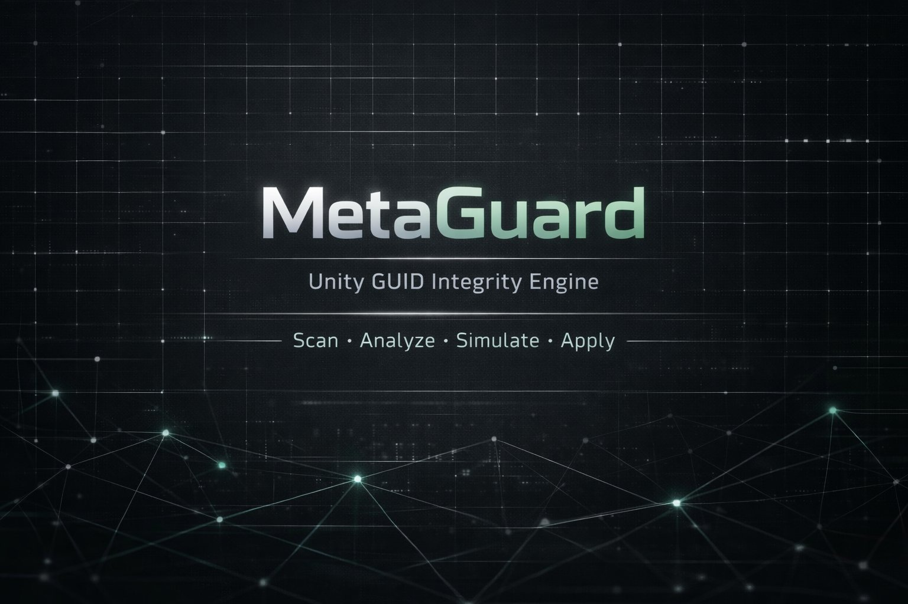

<div align="center">



<br><br>

[](https://unity.com)
[](CHANGELOG.md)
[]()
[](https://assetstore.unity.com/packages/slug/376206)

</div>

> **This documentation reflects MetaGuard Pro 2.x (current stable).** For older versions, see [Legacy Version](#legacy-version) below.

---

## Overview

Unity projects accumulate GUID corruption silently. Broken asset references, duplicate GUIDs, and orphaned `.meta` files compound over time — surfacing during merges, after directory restructuring, or at release.

MetaGuard Pro scans every asset in the project, builds a directed dependency graph, classifies every GUID integrity issue by risk level, tests every proposed fix against the graph before touching any file, and applies only operations it can verify are safe — with a pre-apply snapshot and 48-hour rollback window on every session.

> No file is modified without a recoverable snapshot.
> No operation reaches Apply without passing simulation.

---

## Pipeline

```
Scan  ──►  Analyze  ──►  Simulate  ──►  Apply  ──►  Rollback
```

---

## Quick Start

```
Tools > MetaGuard Pro > Open
```

1. Click **Scan + Analyze**
2. Review detected issues in the **Issues** tab
3. Click **Simulate** — confirm all intended operations show **Safe**
4. Click **Apply** or **Fix All Safe**
5. If the result is unexpected — click **Rollback**

---

## Requirements

- Unity 2020.3 LTS or later (including Unity 6)
- All render pipelines: Built-in, URP, HDRP
- Editor-only — zero runtime footprint, excluded from all builds

---

## Documentation

| Document | Description |
|---|---|
| [Getting Started](versions/v2/getting-started.md) | First scan, first rollback, recommended workflow |
| [Installation](versions/v2/installation.md) | Import steps, folder layout, updating, uninstalling |
| [Usage](versions/v2/usage.md) | Every button, tab, and control explained |
| [Features](versions/v2/features.md) | Full feature reference |
| [Policy System](versions/v2/policy.md) | Per-project rules, team sharing, CI enforcement |
| [CLI & CI Integration](versions/v2/cli.md) | Batch mode, JSON reports, exit codes, GitHub Actions |
| [Safety & Rollback](versions/v2/safety.md) | Snapshot model, session lifecycle, crash recovery |
| [Cache System](versions/v2/cache-system.md) | When to enable, disable, and reset the scan cache |
| [Demo System](versions/v2/demo.md) | Seeding and validating the test environment |
| [Best Practices](versions/v2/best-practices.md) | Team workflows, source control, CI gates |
| [Troubleshooting](versions/v2/troubleshooting.md) | Common issues and resolutions |
| [FAQ](versions/v2/faq.md) | Frequently asked questions |
| [Changelog](CHANGELOG.md) | Full version history |

---

## Support

| Channel | |
|---|---|
| **Discord** | [discord](https://discord.gg/rYbZZz5GH4) — primary support channel |
| **Bug Reports** | [discord](https://discord.gg/mQYguyhYwA) |
| **Email** | [Contact us](tools.studio@zohomail.in) |
| **Asset Store** | [Asset Store](https://assetstore.unity.com/packages/slug/376206) |

---

## Legacy Version

MetaGuard 1.x (free, end-of-life) documentation is preserved at [versions/v1/](versions/v1/).

---

<div align="center">

**Tools Studio** — Professional Unity Tooling

</div>
