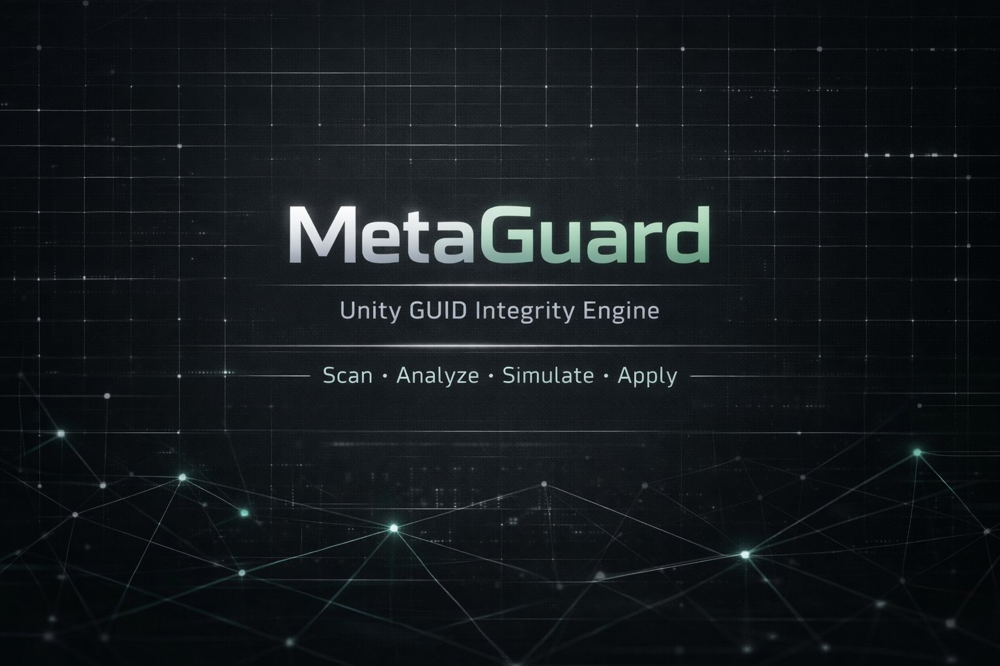

<div align="center">



<br><br>

[](https://unity.com)
[](CHANGELOG.md)
[]()
[](https://assetstore.unity.com/packages/slug/376206)

</div>

> **This documentation reflects MetaGuard 2.x (current stable).** For older versions, see [`/versions/`](versions/).

---

## Quick Start

```
Tools > MetaGuard Pro > Open
```

1. Click **Scan + Analyze**
2. Review detected issues in the **Issues** tab
3. Click **Simulate** — confirm all intended operations show **Safe**
4. Click **Apply** or **Fix All Safe**
5. If the result is unexpected — click **Rollback**

→ New to MetaGuard? Start with [Getting Started](docs/getting-started.md).

---

## Overview

Unity projects accumulate GUID corruption silently. Broken asset references, duplicate GUIDs, and orphaned `.meta` files compound over time — surfacing during merges, after directory restructuring, or at release, when the cost of repair is highest.

MetaGuard scans every asset in the project, builds a directed dependency graph, classifies every GUID integrity issue by risk level, tests every proposed fix against the graph before touching any file, and applies only operations it can verify are safe — with a pre-apply snapshot and 48-hour rollback window on every session.

MetaGuard 2.x includes a per-project policy system, a headless CLI entry point for CI/CD pipelines, a project health history log, and a complete demo system.

> No file is modified without a recoverable snapshot.
> No operation reaches Apply without passing simulation.

---

## Workflow

| Step | Description |
|---|---|
| **Scan** | Enumerate all assets, extract GUIDs, build the dependency graph |
| **Analyze** | Detect issues, classify risk, report a health score (0–100) |
| **Simulate** | Test every proposed fix against an in-memory graph clone — no files touched |
| **Apply** | Write only simulation-approved operations, protected by pre-apply snapshot |
| **Rollback** | Restore all modified files from the snapshot in a single action |

---

## Requirements

- Unity 2020.3 LTS or later (including Unity 6)
- All render pipelines: Built-in, URP, HDRP
- Editor-only — zero runtime footprint, excluded from all builds

---

## Documentation

| Document | Description |
|---|---|
| [Getting Started](docs/getting-started.md) | First scan, first rollback, recommended workflow |
| [Installation](docs/installation.md) | Import steps, folder layout, updating, uninstalling |
| [Usage](docs/usage.md) | Every button, tab, and control explained |
| [Features](docs/features.md) | Full feature reference |
| [Policy System](docs/policy.md) | Per-project rules, team sharing, CI enforcement |
| [CLI & CI Integration](docs/cli.md) | Batch mode, JSON reports, exit codes, GitHub Actions |
| [Safety & Rollback](docs/safety.md) | Snapshot model, session lifecycle, crash recovery |
| [Cache System](docs/cache-system.md) | When to enable, disable, and reset the scan cache |
| [Demo System](docs/demo.md) | Seeding and validating the test environment |
| [Best Practices](docs/best-practices.md) | Team workflows, source control, CI gates |
| [Troubleshooting](docs/troubleshooting.md) | Common issues and resolutions |
| [FAQ](docs/faq.md) | Frequently asked questions |
| [Changelog](CHANGELOG.md) | Full version history |

---

## Support

| Channel | |
|---|---|
| **Discord** | [discord.gg/rYbZZz5GH4](https://discord.gg/rYbZZz5GH4) — primary support channel |
| **Bug Reports** | [discord.gg/mQYguyhYwA](https://discord.gg/mQYguyhYwA) |
| **Email** | tools.studio@zohomail.in |
| **Asset Store** | [assetstore.unity.com/packages/slug/376206](https://assetstore.unity.com/packages/slug/376206) |

See [SUPPORT.md](SUPPORT.md) for full details.

---

## Version History

| Version | Status | Docs |
|---|---|---|
| 2.x | Current stable | This repository |
| 1.x | End of life | [versions/v1/](versions/v1/) |

---

<div align="center">

**Tools Studio** — Professional Unity Tooling

</div>
